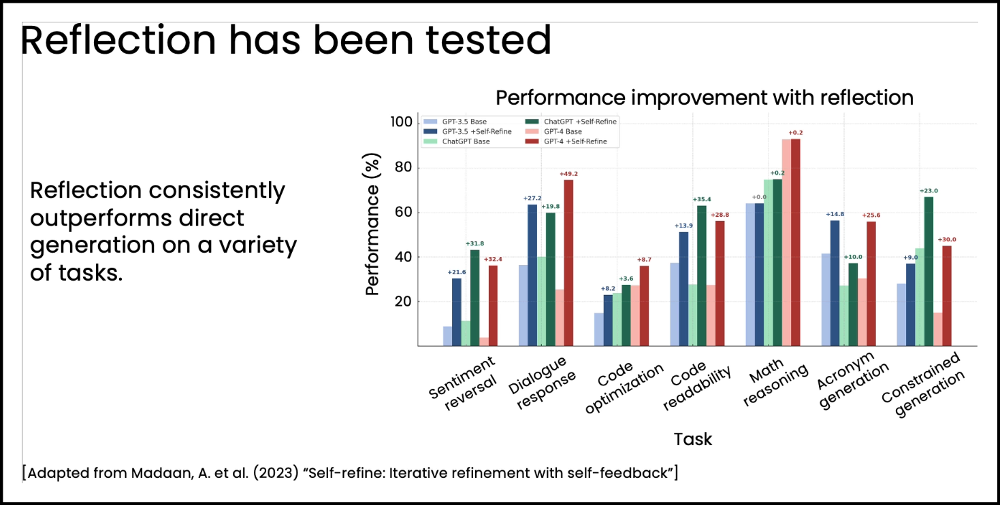
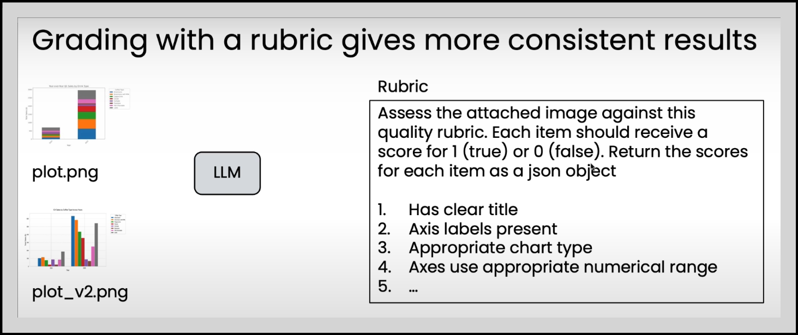
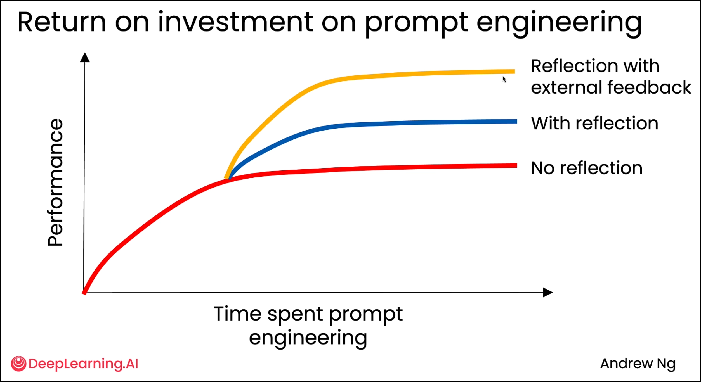

# Reflection Design Pattern

## Direct Generation

Also known as `Zero-shot prompting`, it refers to a simple interaction with an LLM. For example:

> User -> Prompts to LLM -> Answer

In contrast, there are alternatives as `one-shot`, `two-shot` and `few-shot`, where $1$, $2$ or many examples are provided to the LLM regarding the *inputs* and *outputs* of the action it should perform.

## General Notes

- Reflect with a different LLM
  - There are cases where using different LLMs for Generation and Reflection have better results than using the same LLM for both interactions.

## Evaluating the impact of reflection

Some we have the next workflow:

> User's input -> LLM 1 -> LLM 2 -> *Execute SQL* -> *V2 query results* -> LLM

1. User ask an LLM to *create an specific SQL Query*.
1. LLM 1: *generates the SQL Query V1*.
1. LLM 2: reflects on LLM 1's output. *Generates the SQL Query V2*.
1. Then, we execute the SQL query.
1. We gather the V2 query's results.

The idea is to execute the previous worflow with and without *reflection*, and gather the next information:

| Prompts | Ground truth answer | No Reflection | With Reflection |
| --- | --- | --- | --- |
| *How many different items have been sold in May 2025?* | *1244* | *900* | *1244* |
| *Most expensive item?* | *Item # 123* | *Item # 123* | *Item # 123* |

This allows us to measure the impact of reflection in an specific worklow.

### What about subjective tasks?

Again, we use another LLM as a ***judge***.

*Known issues* with using LLMs for comparison:

- Answers often are not very good.
- Position Bias (First option are chosen generally over the second option).

*Solution*: grading with a ***rubric***.

### Evaluating reflection

- Objective evals
  - Code-based evals are easier
  - Build a dataset of ground truth examples
- Subjective evales
  - Use LLM as a judge
  - Rubric-based grading is better

## Using external feedback

## Code samples

### Chart Generation

See an example of the reflection design pattern in the [M2_UGL_1.ipynb](./M2_UGL_1.ipynb) notebook from the `Agentic-AI` course (DeepLearning.ai).

### Improving SQL Generation with reflection

In the [M2_UGL_2.ipynb](./M2_UGL_2.ipynb) notebook from the `Agentic-AI` course (DeepLearning.ai) you can see an example of how to improve SQL generation with reflection.

It gives insights on how to improve the SQL code generation based on not only the SQL query that an LLM generates, but also in the output of such query.
