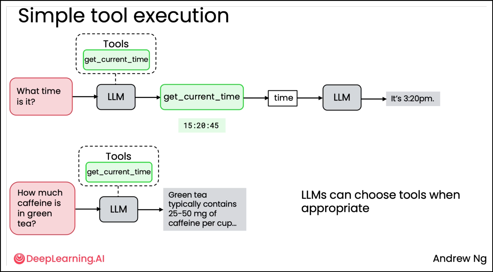

# Tool use

## Creating a tool

Tools are just code that the LLM can request to be executed.

## Code Execution

Basically, the LLM doesn't execute the tools/functions. It simply states *when* they should be used (based on the input the LLM receives).

So, how is the code executex? We should run it, based on the LLM output.

- Python `exec()` function.

However, this is NOT a safe way. Then, it's recommended to execute it in a Sandbox environment (docker, E2B, etc.).

## MCP (Model Context Protocol)

Standard proposed by Anthropic that gives an LLM access to more context and to more tools.

It basically is a standard for applications to get access to tools and data sources.

Currently, there are MCP clients (Cursor, Claude Desktop, Windsurf) and servers (Slack, GitHub, etc.).

## Code samples

See the next code samples from the `Agentic-AI` course (DeepLearning.ai):

- [M3_UGL_1](./M3_UGL_1.ipynb): shows how to use different functions as tools.
- [M3_UGL_2](./M3_UGL_2.ipynb): lab where an LLM-powered email service is simulated.
