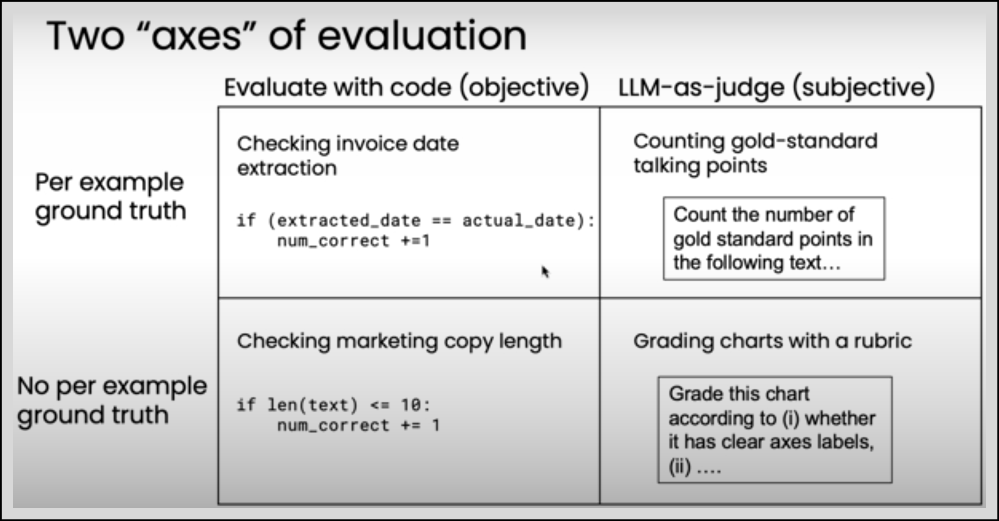
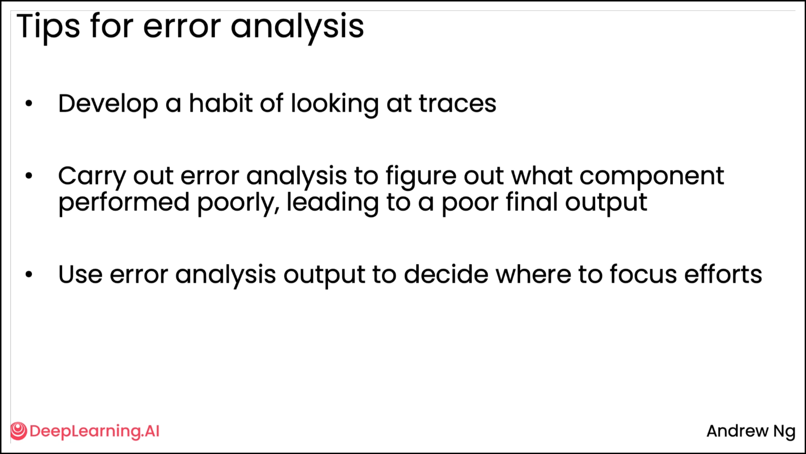
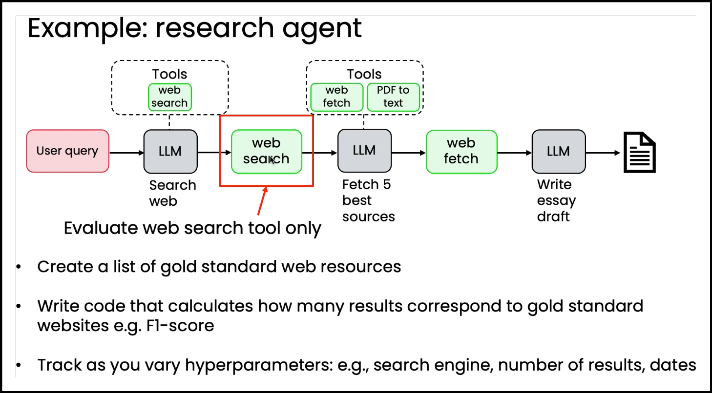

# Practical tips for building Agentic AI

## Axes of evaluation

## Tips for error analysis

## Component-level evaluations

***Benefits***:

- Can provide clearer signal for specific errors.
  - Avoid the noise in end-to-end system.
- More efficient for focused team to optimize.

## Improving LLM component performance

- Improve your prompts
  - Add more explicit instructions.
  - Add one or more concrete example to the prompt.
- Try a new model
  - Try multiple LLMs and use evals to pick the best.
- Split up the step
  - Decompose the task into smaller steps.
- Fine-tune a model
  - Fine tune on your internal data to improve performance.

## Examples

- [M4_UGL_1.ipynb](M4_UGL_1.ipynb): adds a component eval to a research workflow.
