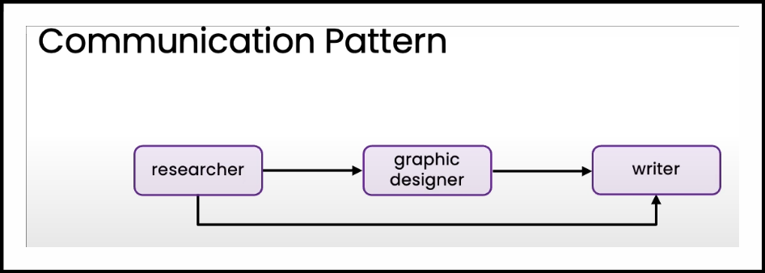

# Patterns for Highly Autonomous Agents

## Formatting plan as JSON

Example:

```txt
You have access to the following tools:

{description of tools}

Create a step-by-step plan in JSON format.

Each step should have the following items:
step number, description, tool name, and args.
```


## Planning with code execution


## Communication patterns for multi-agent systems

### Linear




### Hirarchical


### All-to-all


